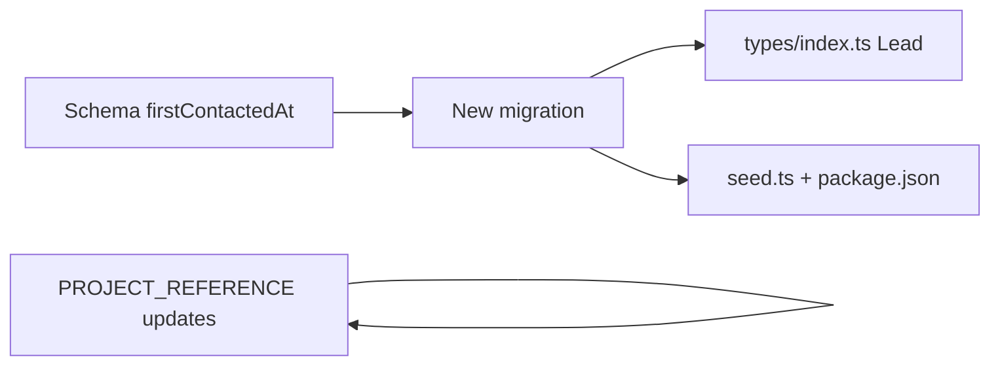

# Finish Phase 2 — Database schema (feature by feature)

## Current state

- `[prisma/schema.prisma](prisma/schema.prisma)` already defines five models (`Staff`, `Lead`, `Task`, `Note`, `Template`) and enums (`Role`, `Language`, `LeadSource`, `LeadStage`, `TemplateCategory`).
- Initial migration exists: `[prisma/migrations/20260404213109_init/migration.sql](prisma/migrations/20260404213109_init/migration.sql)`.
- **Missing vs Phase 2 doc:** no `[prisma/seed.ts](prisma/seed.ts)`, no `prisma.seed` in `[package.json](package.json)`, and `[src/types/index.ts](src/types/index.ts)` `Lead` omits `firstContactedAt` (not yet in DB).

---

## Feature 1 — Response time KPI (`firstContactedAt`)

**Goal:** Store an explicit anchor for “lead response time” (creation → first contact) so Phase 5 does not depend on fragile inference.

- Add nullable `firstContactedAt DateTime?` on `Lead` in `[prisma/schema.prisma](prisma/schema.prisma)`.
- Generate a **new** migration (e.g. `npx prisma migrate dev --name add_lead_first_contacted_at`) so Supabase gets an `ALTER TABLE` adding the column.
- In `[src/types/index.ts](src/types/index.ts)`, add `firstContactedAt?: Date` to the `Lead` interface.

**Convention (document only in this phase):** When implementing PATCH/notes in Phase 3+, set `firstContactedAt` the first time it is still null and the lead is considered “contacted” (e.g. stage moves to `contacted` or first outbound note — pick one rule and stick to it). The plan is schema + types now; behavior ships with API/UI.

---

## Feature 2 — Urgency (no new column)

**Goal:** Align the board’s “urgency” with data you already have.

- In `[PROJECT_REFERENCE.md](PROJECT_REFERENCE.md)`, add a short **Phase 2 / UI convention** note: lead urgency in Phase 3 is **derived**, not a DB column — e.g. combine `isHot`, open tasks with `dueAt < now()` and `done === false`, and optionally sort order. No Prisma change unless product later asks for manual priority.

---

## Feature 3 — `Role` enum clarity

**Goal:** One place that lists values and future auth intent.

- In `[PROJECT_REFERENCE.md](PROJECT_REFERENCE.md)` (e.g. under Database / Staff or Phase 2), document: `Role` = `admin` | `staff` | `doctor` (matches `[prisma/schema.prisma](prisma/schema.prisma)`).
- One line: **Supabase Auth user ↔ `Staff` row** linking is deferred until you implement login; schema stays clinic-domain roles only.

---

## Feature 4 — Template category ↔ Phase 6 labels

**Goal:** Avoid drift between enum and product copy.

- Add a small mapping in `[PROJECT_REFERENCE.md](PROJECT_REFERENCE.md)` (table or bullet list), e.g. `welcome` → Welcome, `follow_up` → Follow-up, `deposit_reminder` → Deposit reminder, `confirmation` → Consultation confirmation, `re_engage` → Re-engagement.
- Seed data (next feature) uses **enum values**; UI strings use the human labels in Phase 6.

---

## Feature 5 — Project paths / docs accuracy

**Goal:** Reference doc matches the repo.

- Confirm `[PROJECT_REFERENCE.md](PROJECT_REFERENCE.md)` folder tree matches reality: app lives under `[src/app/](src/app/)` (already consistent with your layout). Adjust only if any section still says `app/` without `src/`.

---

## Feature 6 — Seed: sample staff + templates

**Goal:** Satisfy “Seed file with sample staff and templates” and make Phase 3 manual testing easy.

- Add `[prisma/seed.ts](prisma/seed.ts)` that:
  - Upserts or creates **2–3 `Staff`** rows with varied `Role` and realistic `email` / `avatarInitials`.
  - Creates `**Template**` rows covering multiple `Language` and `TemplateCategory` values (thin bodies are fine; focus on variety for filters later).
- Wire Prisma seed in `[package.json](package.json)`: `"prisma": { "seed": "tsx prisma/seed.ts" }` and add devDependency `**tsx**` (standard Prisma + TypeScript seed runner).
- Run `npx prisma db seed` locally after migrate to verify (execution step after you approve the plan).

---

## Feature 7 — Apply migration to Supabase + regenerate client

- After schema + migration files exist: run `npx prisma migrate deploy` against your Supabase `DATABASE_URL` (or `migrate dev` in dev only).
- Run `npx prisma generate` so `[src/generated/prisma](src/generated/prisma)` includes `firstContactedAt` on `Lead`.

---

## Feature 8 — Close Phase 2 in the reference

- Update **Build Progress** in `[PROJECT_REFERENCE.md](PROJECT_REFERENCE.md)`: check Phase 2 complete.
- Optionally expand the **Phase 2** bullet list to mention: `firstContactedAt`, seed command, and the KPI/urgency/role/template notes above (keeps future phases honest).

---

## Dependency order (execution)

Schema + migration first, then types and seed in parallel with doc edits, then `generate`, `deploy`, `db seed`.

---

## Out of scope for Phase 2 (explicit)

- API routes, Zod, or setting `firstContactedAt` in application code (Phase 3+).
- Replacing `[src/types/index.ts](src/types/index.ts)` with re-exports from `@prisma/client` (optional refactor; not required to finish Phase 2).
