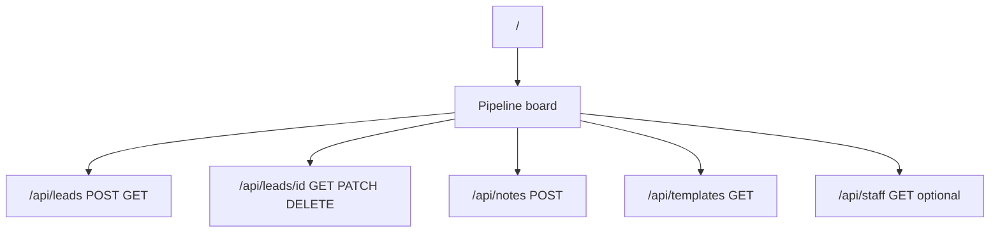
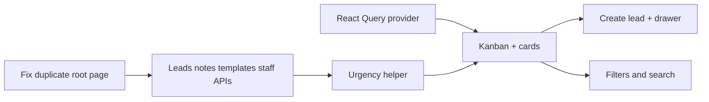

# Phase 3 — Pipeline board (feature-by-feature plan)

## Interpretation

You asked to validate the **route/file tree** (likely “face tree” → **route tree** / **folder structure**). The canonical target is [phase_goal/PROJECT_REFERENCE.md](phase_goal/PROJECT_REFERENCE.md) **Folder Structure** section; the repo is **not** there yet: APIs are stubs, UI folders are missing, and there is a **critical routing conflict** (see below).

---
|----------|--------|
| Pipeline URL | **`/` (root)** — CRM pipeline is the main entry; no separate `/pipeline` segment for Phase 3. |
| `(dashboard)/layout.tsx` | **App shell now** — header + **sidebar with nav placeholder** (stub links for Phase 5 analytics/reporting later). |

**Implementation:**

1. **Remove** [src/app/page.tsx](src/app/page.tsx) so a single route owns `/` (avoids conflict with `(dashboard)/page.tsx`).
2. Keep the pipeline page at [src/app/(dashboard)/page.tsx](src/app/%28dashboard%29/page.tsx) as the Kanban at **`/`**.
3. Implement [src/app/(dashboard)/layout.tsx](src/app/%28dashboard%29/layout.tsx) as the CRM chrome: e.g. top bar (product name), sidebar with **Pipeline** (active) and disabled or “Coming soon” entries for future **Analytics / Dashboard** (Phase 5).

**Docs:** When updating [phase_goal/PROJECT_REFERENCE.md](phase_goal/PROJECT_REFERENCE.md), describe `(dashboard)/page.tsx` as **Pipeline (main CRM view) at `/`**, not “KPI dashboard”; reserve `/analytics` or `/reports` (exact path TBD in Phase 5) for KPIs.

### 2) Align `Lead` types with the database

[src/types/index.ts](src/types/index.ts) has `notes?: string` on `Lead`, but Prisma models **notes as a separate `Note[]` relation** ([prisma/schema.prisma](prisma/schema.prisma)). For Phase 3:

- Prefer types like `Lead` (base) + `LeadWithBoardRelations` (or similar) with `staff`, `tasks`, `notes` (array), and optional aggregates—**do not** use a fake `notes` string on `Lead`.

### 3) React Query provider

[@tanstack/react-query](package.json) is installed but [src/app/layout.tsx](src/app/layout.tsx) has no `QueryClientProvider`. Add a small client `Providers` component (e.g. [src/components/Providers.tsx](src/components/Providers.tsx)) and wrap `children` in the root layout so list/drawer queries work.

### 4) Optional API: staff list

Phase 3 filters include **Staff** and the create-lead form needs an owner. [PROJECT_REFERENCE.md](phase_goal/PROJECT_REFERENCE.md) lists `api/leads/`, `tasks/`, `notes/`, `templates/` but not `staff/`. **Suggestion:** add `GET /api/staff` (read-only) for dropdowns/filters; keeps `GET /api/leads` focused on leads.

---

## Suggested Phase 3 scope tweaks (before you build)

| Topic                     | Suggestion                                                                                                                                                                                                                                                                                                                                       |
| ------------------------- | ------------------------------------------------------------------------------------------------------------------------------------------------------------------------------------------------------------------------------------------------------------------------------------------------------------------------------------------------ |
| `**firstContactedAt` rule | Pick **one** rule and document it: e.g. set when `stage` first becomes `contacted` **or** on first note (outbound)—Phase 2 plan preferred tying it to “contacted” / first touch; implementing both can double-set; prefer **PATCH lead** when stage hits `contacted`, and optionally when creating the first note if you treat notes as contact. |
| **“Local” filter**        | Treat as `**isForeign === false` (document in UI).                                                                                                                                                                                                                                                                                               |
| **Templates in drawer**   | Phase 6 deep-polishes templates; Phase 3 only needs **GET templates** (filter by `language` + maybe `category`) + copy-to-clipboard.                                                                                                                                                                                                             |
| **Auth / current user**   | No Supabase Auth ↔ Staff yet. For mutations, use **explicit `staffId`** on create/update/note, or a **dev-only default** (e.g. first seeded staff) until login exists.                                                                                                                                                                           |

---

## Target route tree (after Phase 3)

Conceptual URLs (adjust if you split marketing vs app):

**API files to add (per reference + staff):**

| Path                                                     | Role                                                            |
| -------------------------------------------------------- | --------------------------------------------------------------- |
| [src/app/api/leads/route.ts](src/app/api/leads/route.ts) | Replace stub: `GET` (query: search, filters), `POST` (Zod body) |
| `src/app/api/leads/[id]/route.ts`                        | `GET` (detail + relations), `PATCH`, optional `DELETE`          |
| `src/app/api/notes/route.ts`                             | `POST` (create note; link `leadId`, optional `staffId`)         |
| `src/app/api/templates/route.ts`                         | `GET` (query: `language`, optional `category`)                  |
| `src/app/api/staff/route.ts`                             | `GET` — optional but practical                                  |

**UI folders (per reference):**

- [src/components/pipeline/](src/components/pipeline/) — board column, drag optional later (start with column-per-stage + move via PATCH)
- [src/components/leads/](src/components/leads/) — `LeadCard`, `LeadDrawer`, `CreateLeadForm`, urgency badge
- Shared: filters toolbar, search input, template picker (combobox/select)

---

## Feature-by-feature implementation order

**A — Data layer (APIs + Zod)**

1. **List + create leads** — `GET/POST` [src/app/api/leads/route.ts](src/app/api/leads/route.ts): Prisma `findMany` with `include: { staff: true, tasks: true }` (tasks needed for **derived urgency** per [PROJECT_REFERENCE.md](phase_goal/PROJECT_REFERENCE.md) Derived Fields). Validate query params (search string, `isForeign`, `isHot`, `staffId`, `source`) with Zod.
2. **Single lead + patch** — `src/app/api/leads/[id]/route.ts`: `GET` with `notes` ordered by `createdAt`, `PATCH` for stage, owner, flags, `lostReason` when `lost`. **Set `firstContactedAt`** once when transitioning into a “contacted” state per your chosen rule.
3. **Notes** — `POST /api/notes` to append conversation/internal lines; return updated lead or note as needed for React Query invalidation.
4. **Templates** — `GET /api/templates` for drawer quick-reply (filter by lead language).
5. **Staff** — `GET /api/staff` for filters and create form.

**B — Derived urgency helper**

- Server-side (or shared pure function in `src/lib/`): `urgent = isHot || tasks.some(t => !t.done && t.dueAt < now)` using UTC `now` consistent with stored `dueAt`.

**C — UI shell**

1. **Providers** — React Query + Tooltip already in layout.
2. **Dashboard layout** — [src/app/(dashboard)/layout.tsx](src/app/%28dashboard%29/layout.tsx): **app shell** — header + sidebar; nav placeholder for Phase 5 (per locked decision above).
3. **Pipeline page** — main board: 8 columns × `LeadStage` order from reference; each column maps `stage` enum.

**D — Interactions**

1. **Create lead** — dialog/sheet with Zod client validation mirroring API; React Query `useMutation` + invalidate `['leads']`.
2. **Lead drawer** — `Sheet`/`Drawer` ([src/components/ui/drawer.tsx](src/components/ui/drawer.tsx) already present): profile fields, stage `<Select>`, notes list, template select + copy.
3. **Filters + search** — client state or URL search params; filter **client-side** after fetch or **server-side** via query params (preferred for large datasets).

**E — Polish**

1. **Dates** — display with Asia/Bangkok (project convention); store UTC in DB (already).
2. **Metadata** — update [src/app/layout.tsx](src/app/layout.tsx) title/description from “Create Next App”.

---

## Dependency diagram (build order)

---

## What stays out of Phase 3 (per reference)

- Full **task queue UI** and overdue treatment beyond what’s needed for **urgency on cards** (Phase 4).
- **KPI dashboard** (Phase 5).
- Template **management** UI and heavy polish (Phase 6).
- **Webhooks** (Phase 7).

---

## Summary

- **File tree:** Follow [phase_goal/PROJECT_REFERENCE.md](phase_goal/PROJECT_REFERENCE.md); add `api/staff`, `leads/[id]`, `notes`, `templates`; add `components/pipeline/` and `components/leads/`.
- **Must-fix:** duplicate **`/`** — remove [src/app/page.tsx](src/app/page.tsx); pipeline at **`/`** via [src/app/(dashboard)/page.tsx](src/app/%28dashboard%29/page.tsx); shell in [src/app/(dashboard)/layout.tsx](src/app/%28dashboard%29/layout.tsx).
- **Tighten:** remove misleading `Lead.notes` string; clarify **pipeline vs analytics** naming for Phase 5; lock `firstContactedAt` and **Local** filter rules before coding PATCH behavior.
